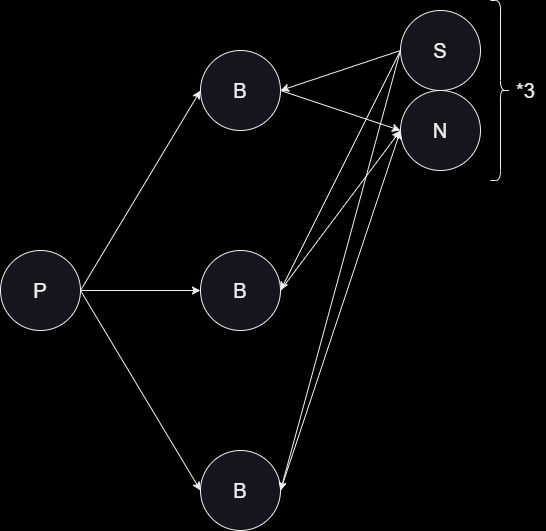

# EBS Project

## Students

- David Viziteu
- Andrei Stoleru

## Topology

<p align="center">
  
</p>

## Performance

Tests were ran 5 times.

### 100% '=' subscriptions

```
Number of publications: 843885.0
Avg latency(milli): 216.48734
Avg match rate: 19.880926
```

### 25% '=' subscriptions

```
Number of publications: 24707.0
Avg latency(milli): 5377.8657
Avg match rate: 679.04706
```


```
cli:
brew install --cask temurin@17     

mvn -q clean compile
mvn clean install -Dcmake.args="-DCMAKE_OSX_ARCHITECTURES=arm64"

mvn package -DskipTests 2>&1

mvn exec:java -Dexec.mainClass="Main" -Dexec.args="/Users/davidv/Documents/EBS_Project/ebs-project/results.json" 2>&1
```