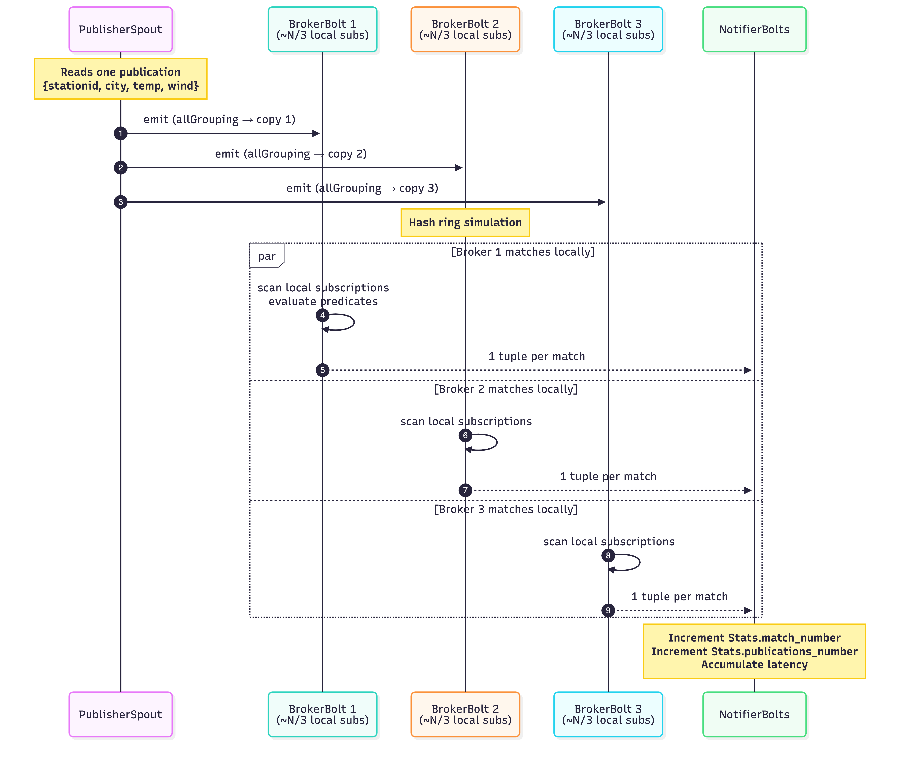
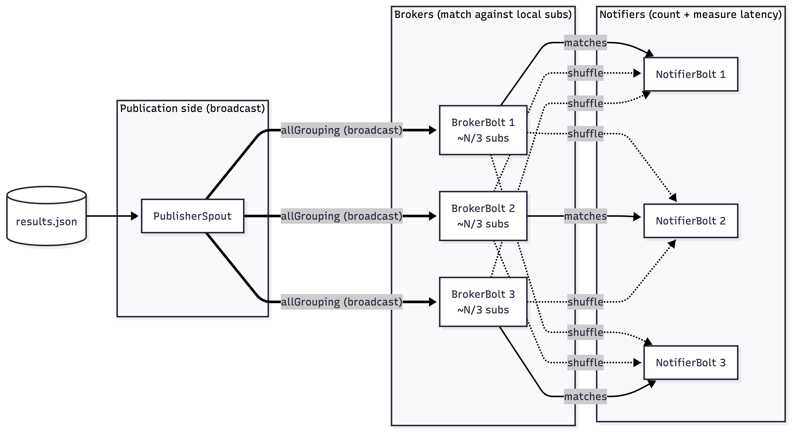
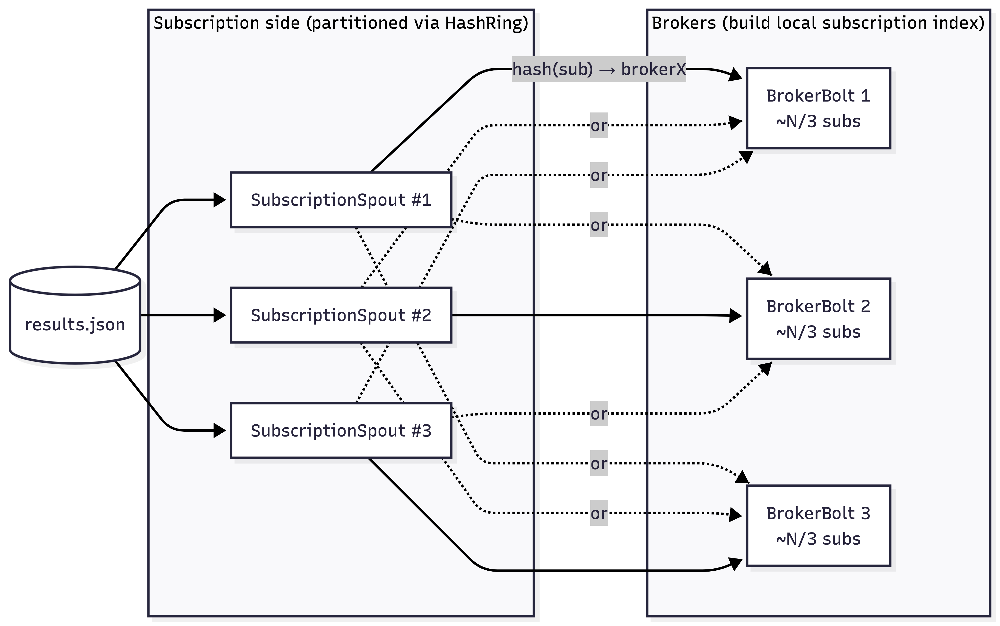
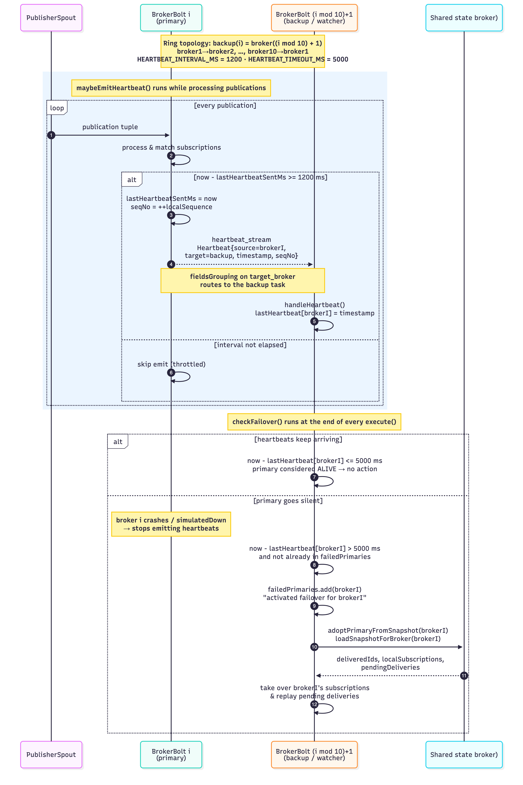

# EBS Project

## Students

- David Viziteu
- Andrei Stoleru

## Topology

### Notification Flow









## Performance

All tests were ran 5 times.

`Number of publications` = the total count of publications actually processed by the brokers during the run

`Avg latency(milli)` = the time from when a publication was stamped at its source (spout) to when a broker processed it

`Avg match rate` = the average number of subscription matches per publication

## Performance - without broker down


### 100% '=' subscriptions

```
Number of publications: 168770.0
Avg latency(milli): 6019.087
Avg match rate: 2.9956982
```

### 25% '=' subscriptions

```
Number of publications: 69095.0
Avg latency(milli): 10934.608
Avg match rate: 2.999045 
```


## Performance - with broker down

### 100% '=' subscriptions

```
Number of publications: 200383.0
Avg latency(milli): 75118.945
Avg match rate: 2.9956982
```

### 25% '=' subscriptions

```
Number of publications: 247490.0
Avg latency(milli): 220414.69
Avg match rate: 2.999045
```


# Appendix
cli:
```
brew install --cask temurin@17     

mvn -q clean compile
mvn clean install -Dcmake.args="-DCMAKE_OSX_ARCHITECTURES=arm64"

mvn package -DskipTests 

mvn exec:java -Dexec.mainClass="Main" -Dexec.args="/Users/davidv/Documents/EBS_Project/ebs-project/results.json"
```